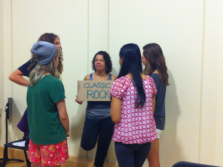
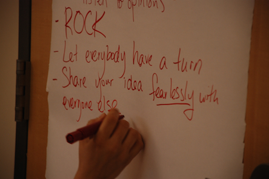
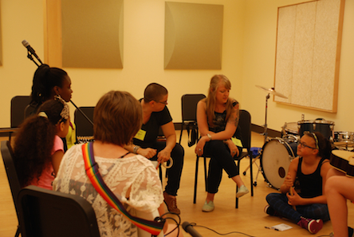

_Five girls who participated in last year’s Girls Rock Internship and Training program - GRITs - have returned this year._

_These post-GRITs are collaborating on documenting this year’s camp._

_Here are their post-Grit notes:_

**Band formation**

The girls meet each other and form bands!

The main fuel of camp is the process of working together with a band to create a song to perform on Friday night. The creation of these bands is one of the most important parts of camp; these bands are created in the opening activity!

This year, volunteers split up and carried signs that read different genres of music (classic rock, pop, indie rock/alternative, singer-song writer etc.)

The girls then go around to their favorite genre, creating a couple groups of girls that have a similar musical interest. These girls then talk to each other, meeting new people. They then mix it up once again and go to a different genre, their second favorite, and meet another group of like-minded musicians.

After they go through this process a couple times they then meet up in their final group with the general set-up of one drummer, one vocalist, one to two guitarists, and/or a keyboardist/bassist. This group is then their final band!

**Teamwork amongst strangers**

 

_above: Honey Beasts set ground rules for collaboration_

As we all know, it can be a challenge to have a calm, mature conversation, even with people we have known for years—but apparently not for this group of girls who just met! The immediate respect and cohesiveness this band exhibited was astounding as they began to set down the ground rules for their band, and I can’t wait to see what their collective imagination will produce!

**Musical pros since day one**

<iframe src="//www.youtube.com/embed/Pj0R502gqXs?rel=0" height="315" width="560" allowfullscreen frameborder="0"></iframe>

_above: for many of these girls, this was their first lesson on the instrument they will play onstage on Friday_

Some girls are just born to rock—and they are all at this camp. First day of lessons went fabulously, and by the end of the week they will all be pros! Here are some shots of drummers, bassists, vocalists, keyboardists, and guitarists in action...

**Lyrical Awesomeness**

<iframe src="//www.youtube.com/embed/e8-vmO2kTcI?rel=0" height="315" width="560" allowfullscreen frameborder="0"></iframe>

_above: the songwriting workshop is just one of nine workshops this week_

Today campers participated in a songwriting workshop to get ready to rock with their bands. They learned about lyrical organization and chord progressions, and even wrote their own original song in just a few minutes! I cannot wait to see what they all create this week.

**Band names**

The official names of the ten camper bands that will perform on Sunday are:

The Deep Blue Honey Beast Rock City of 5 Weather Veins Black Widows The New Element Untitled Trouble Tones Pink Yetis The Strangers

<iframe src="//www.youtube.com/embed/PfxHWt66jmc?rel=0" height="315" width="560" allowfullscreen frameborder="0"></iframe>

 

[notes from day two...](http://girlsrockri.org/notes-on-day-two-of-girls-rock-camp-2014/ "Notes on day two of Girls Rock Camp 2014")
