This year, Girls Rock! RI has twice the camp.

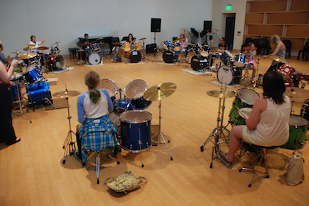

 

The first of two sessions began today, this one dedicated to campers aged eleven to thirteen.

[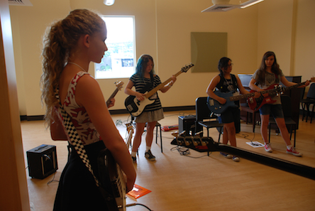](http://girlsrockri.org/wp-content/uploads/2015/07/summer-8595.jpg)

 

Ten new bands formed today:

Rockin’ Robots Explosive Notez The Danger Zone Cherry Blossoms Sunnyside Up Soul Goddess Lyrical Vintage Fourmal Females Faceless Kneesocks …and a five-piece to be named later

[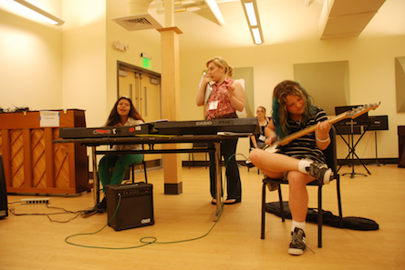](http://girlsrockri.org/wp-content/uploads/2015/07/summer-8596.jpg)

 

A peek at a band name brainstorm:

[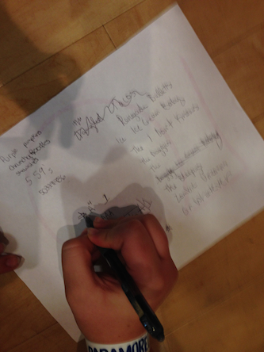](http://girlsrockri.org/wp-content/uploads/2015/07/summer-8597.jpg)

 

After bands were formed, they went straight into band practice, making their first sounds under the guidance of a band coach.

[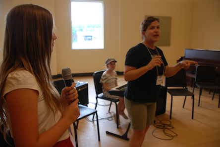](http://girlsrockri.org/wp-content/uploads/2015/07/summer-8598.jpg)

[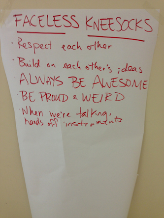](http://girlsrockri.org/wp-content/uploads/2015/07/summer-8599.jpg)

[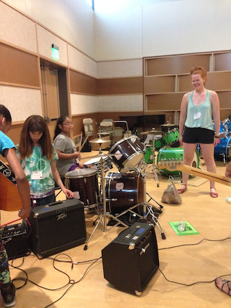](http://girlsrockri.org/wp-content/uploads/2015/07/summer-8600.jpg)

 

Beyond the two Girls Rock! RI staff members, all of the adults are trained, unpaid volunteers.

[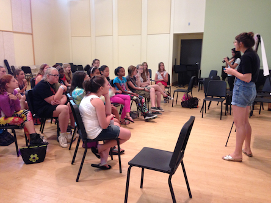](http://girlsrockri.org/wp-content/uploads/2015/07/summer-8602.jpg)

[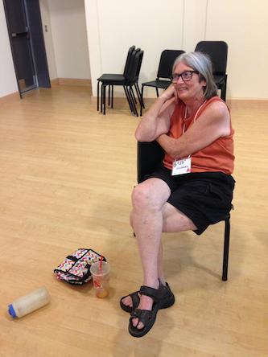](http://girlsrockri.org/wp-content/uploads/2015/07/summer-8601.jpg)

 

 

During the discussion of ground rules, it was firmly established: never apologize for rocking.

[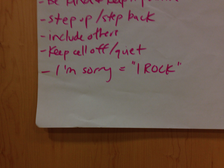](http://girlsrockri.org/wp-content/uploads/2015/07/summer-8606.jpg)

 

There is a tradition of bands coming to camp to perform and lead conversation with campers. It’s a nice change of pace for a touring band like Heathers, who were in town from Montreal.

[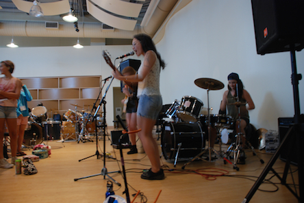](http://girlsrockri.org/wp-content/uploads/2015/07/summer-8604.jpg)

[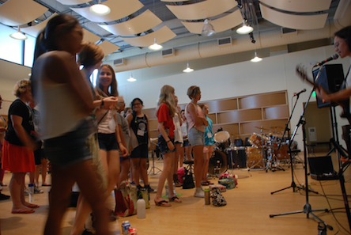](http://girlsrockri.org/wp-content/uploads/2015/07/summer-8605.jpg)

 

The morning workshop was on songwriting basics; this afternoon, History of Women who Rock.

[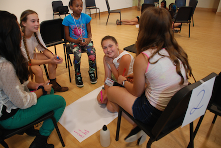](http://girlsrockri.org/wp-content/uploads/2015/07/summer-8603.jpg)

 

Somewhere in there, they also had instrument lessons. This is the sound of eleven girls getting loud.

<iframe src="https://www.youtube.com/embed/jHeUPdRfxAw?rel=0" width="560" height="315" frameborder="0" allowfullscreen="allowfullscreen"></iframe>

 

[more photos from day one](https://www.flickr.com/photos/girlsrockri/sets/72157655780356756)
