This week, these girls will learn to be loud.

> [GRC ROUND 2 HAS COMMENCED #girlsrockcamp #gettinloud](https://instagram.com/p/6NIeiQivf9/)
> 
> A video posted by Girls Rock! Rhode Island (@girlsrockri) on Aug 10, 2015 at 6:52am PDT

 

off [the @girlsrockri twitter feed](http://twitter.com/girlsrockri):

[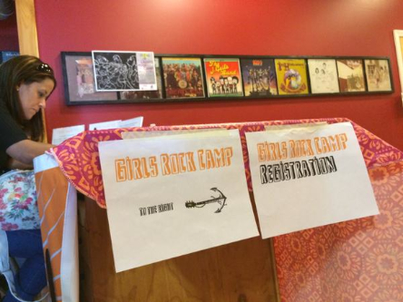](http://girlsrockri.org/wp-content/uploads/2015/08/phone-86481.jpg)

Welcome to this summer's second Girls Rock camp! 30 girls are forming bands, writing songs and will perform Friday!

 

[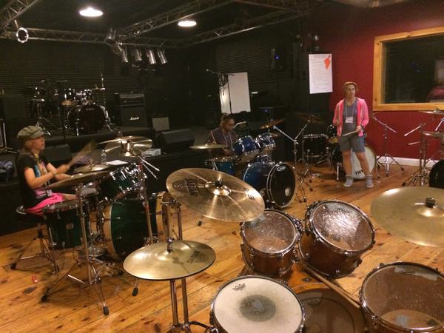](http://girlsrockri.org/wp-content/uploads/2015/08/phone-86471.jpg)

Drummers drumming.

 

[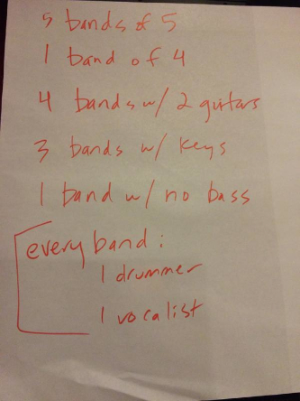](http://girlsrockri.org/wp-content/uploads/2015/08/phone-86461.jpg)

Here's the band makeup for session two.

 

[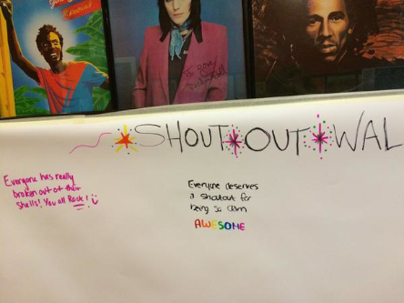](http://girlsrockri.org/wp-content/uploads/2015/08/phone-86451.jpg)

Each week starts with a new Shout Out Wall. Watch it fill up during the week!

 

[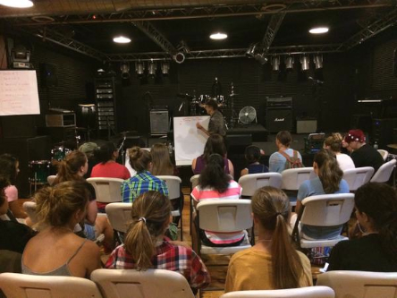](http://girlsrockri.org/wp-content/uploads/2015/08/phone-86441.jpg)

Song-writing workshop... it's on!

 

[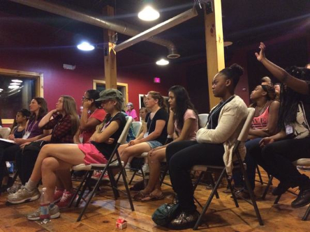](http://girlsrockri.org/wp-content/uploads/2015/08/phone-86431.jpg)

Aretha Franklin's Chain of Fools is great for lesson one about the different parts of a song.

 

[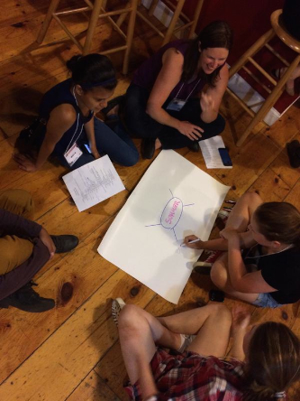](http://girlsrockri.org/wp-content/uploads/2015/08/phone-86421.jpg)

Brainstorming with a blank sheet of paper.

 

[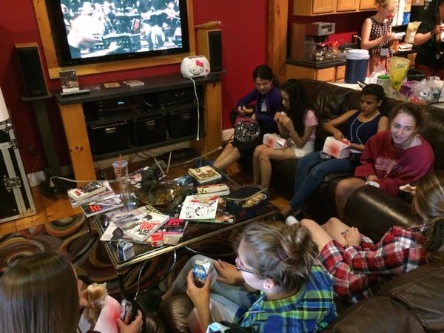](http://girlsrockri.org/wp-content/uploads/2015/08/phone-86411.jpg)

Lunch break!

 

[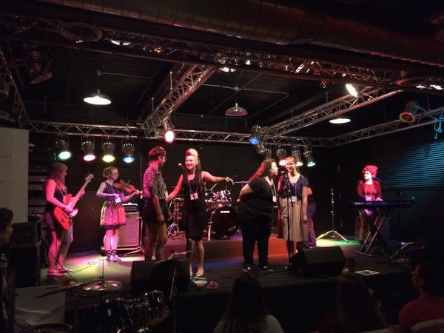](http://girlsrockri.org/wp-content/uploads/2015/08/phone-86401.jpg)

A lunch performance from the band TBA, which formed about ... four minutes ago!

 

[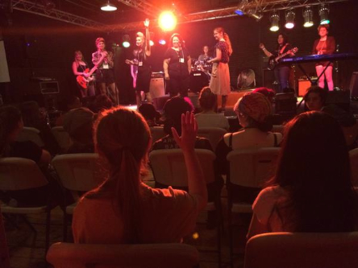](http://girlsrockri.org/wp-content/uploads/2015/08/phone-8639.jpg)

TBA getting a little feedback from the audience.

 

[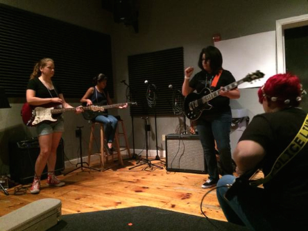](http://girlsrockri.org/wp-content/uploads/2015/08/phone-8638.jpg)

Guitar practice!

 

[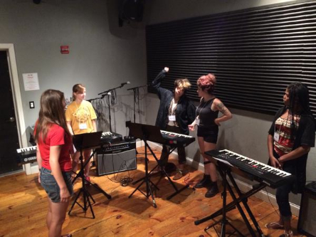](http://girlsrockri.org/wp-content/uploads/2015/08/phone-8637.jpg)

The keyboardists just played a minor scale for the first time!

 

[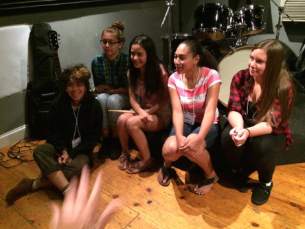](http://girlsrockri.org/wp-content/uploads/2015/08/phone-8636.jpg)

Bands are meeting for afternoon practice and name brainstorming. This band just became Femme Frequency!

 

[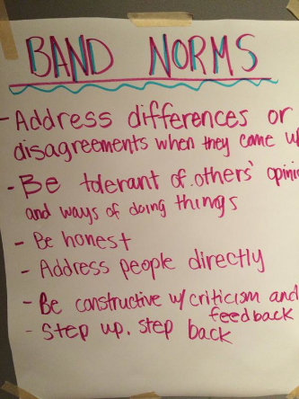](http://girlsrockri.org/wp-content/uploads/2015/08/phone-8635.jpg)

Band ground rules.
