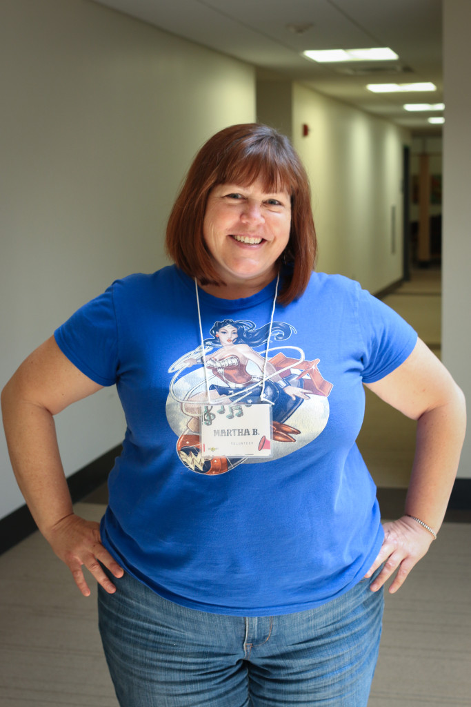

_This was Martha's first summer as a volunteer at Girls Rock Camp. After years of watching her friends' daughters perform, she signed up for Ladies Rock Camp last spring with no musical experience ("It's like a bungee jump. It really felt like I was standing there going, oh my God, I can't believe I'm doing this. But I'm going to do this. [I'm going to jump.](https://www.youtube.com/watch?v=DglubnqakPo)"). At camp, Martha rocked superheroine t-shirts and played the important role of on-site Social Worker and Mental Health Counselor._

\------

I think that this is a transformative experience for a lot of these girls.

I like looking at nonverbal communication and body language. I watched the campers yesterday in an ice breaker, with a lot of their shoulders hunched down, and heads dropped, and voices very quiet. And today I’m seeing everyone's shoulders back, and their heads up, and their voices loud.

What we're seeing here is pretty magical. **The need to belong is really important for all of us.** 

In March of this year, I did Ladies Rock Camp. I don't play any instruments, so I ended up learning to play the bass. And I also ended up doing vocals in my band, which I didn't expect to do.

Right before we were up to begin on stage - we were the first band - my heart was beating so loud and strong, I thought I was going to just pass out right there. But then once we started playing, it was wonderful.

I was so transformed by that experience. When we go through our day-to-day life, we kind of all have a lens that we're looking out of. **And I feel like I ended up putting back on a lens that I hadn't been looking through in a long time.** I like surprises in life. I like adventures. It reminded me of that side of myself.

Nervousness is on the same continuum is excitement. So, if you think about it, it's on the way to having fun.

\------

_Martha's story is part of a weekly series called **ON THE MIC** that shares voices and faces from camp this summer. _A new story will be posted every Tuesday through the end of the year. __The stories are produced by Alex Braunstein of [One Little Did](http://www.onelittledidstories.com/).____

_[Click here](https://www.razoo.com/story/Girls-Rock-Rhode-Island) to support Girls Rock! Rhode Island and more stories like Martha's._
