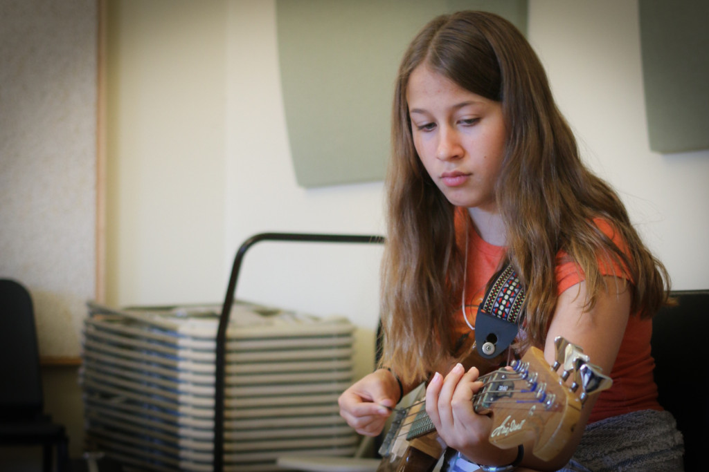

_**Frannie is 13 years old and lives in Pawtucket. This was her second summer at Girls Rock Camp and her first time on a bass guitar. Frannie is from a family of rockers: her sister is also a Girls Rock Camp alum, and her aunt is a Ladies Rock Camp alum who volunteered as a band counselor this summer! In addition to musicals, she's a fan of Green Day and Aerosmith and "stuff from the 80's."**_

——

I really like musicals. A lot of people say that they like Disney movies or something, but I like musicals.

I also really like acting because it kind of just comes to me naturally. I don't think about it that much when I act. I just kind of do it, and I feel like I can easily change the character that I am.

**It helps me understand what people are feeling**. Usually my friends talk to me about how they're feeling, and I can understand where they're coming from because I kind of put myself in their situation.

I learned that being part of a band is much harder than just playing a song, because you might have an idea of a song in your head, but other people do, too. You might want to be leaning the song towards your idea, but since everybody plays their own instrument, you get to listen to different kinds of beats and tunes and sounds. And some of them work together, and some of them don't.

**But finding what does work together really changes the song and makes it something great.**

——

_Frannie's story is part of a weekly series called **ON THE MIC** that shares voices and faces from camp this summer. _A new story will be posted every Tuesday through the end of the year. __The stories are produced by Alex Braunstein of [One Little Did](http://www.onelittledidstories.com/).____

_[Click here](https://www.razoo.com/story/Girls-Rock-Rhode-Island) to support Girls Rock! Rhode Island and more stories like Frannie's._
