[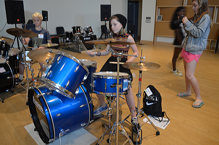](http://girlsrockri.org/wp-content/uploads/2016/08/drummers-100612.jpg)

 

This week, seven former campers were GRITs, part of the Girls Rock Internship Training program.

 

[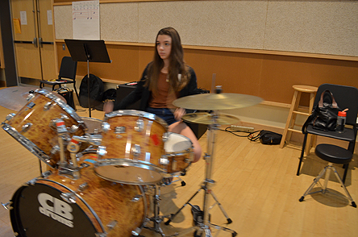](http://girlsrockri.org/wp-content/uploads/2016/08/drummers-100622.jpg)

 

Today, they wrote letters to future GRITs, reflecting on the experience of growing up at camp and taking on more responsibility in the Girls Rock! RI community.

 

[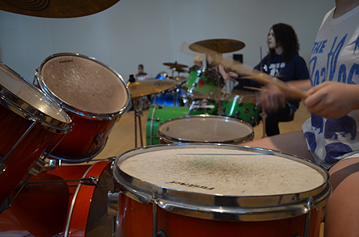](http://girlsrockri.org/wp-content/uploads/2016/08/drummers-100632.jpg)

 

_Here are some things I want you to know:_

 

[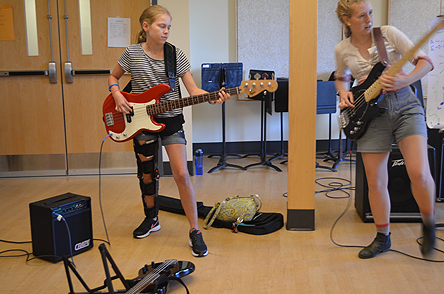](http://girlsrockri.org/wp-content/uploads/2016/08/drummers-100642.jpg)

 

_Everything is exactly how it seems but ten times more._

 

[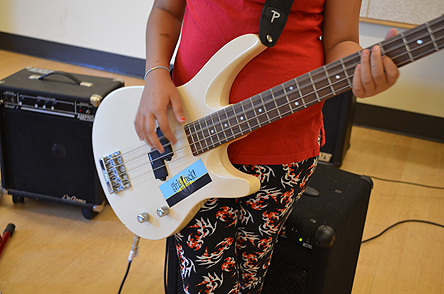](http://girlsrockri.org/wp-content/uploads/2016/08/drummers-100662.jpg)

 

_The GRITs do help with lessons but they do so much more._

 

[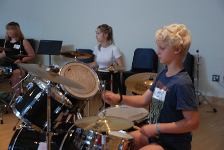](http://girlsrockri.org/wp-content/uploads/2016/08/drummers-100672.jpg)

 

_Moving basses and amps room to room is probably my least favorite part but someone has to do it._

 

[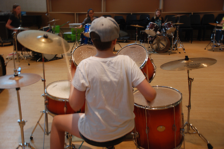](http://girlsrockri.org/wp-content/uploads/2016/08/drummers-100682.jpg)

 

_It’s a ton of fun! I know it may not seem like it would be fun, after seeing us lugging amps and instruments back and forth from lessons to band rooms every day, but it’s not that bad and responsibility is pretty cool._

 

[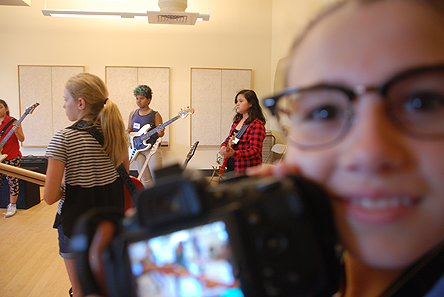](http://girlsrockri.org/wp-content/uploads/2016/08/drummers-100692.jpg)

 

_Another duty is getting here an hour early to tune everything and set up._

 

[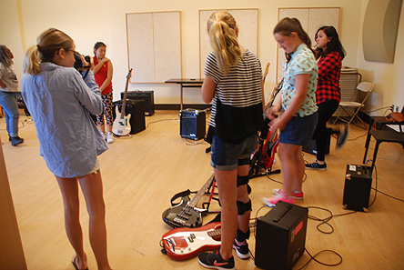](http://girlsrockri.org/wp-content/uploads/2016/08/drummers-100702.jpg)

 

_You have super-secret meetings during regular workshops and lessons; not really secret but you take pictures and write for the blog._

 

[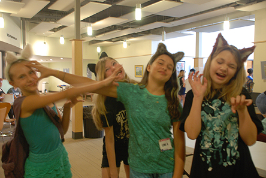](http://girlsrockri.org/wp-content/uploads/2016/08/drummers-100713.jpg)

 

_Something you may not know is GRITs have workshops of their own, too, but they’re just very different._

 

[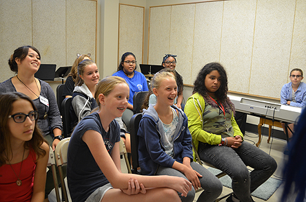](http://girlsrockri.org/wp-content/uploads/2016/08/drummers-10072.jpg)

 

_I would’ve never guessed there could be a whole lesson on how to wrap a cord, but it's actually way more complicated than it seems._

 

[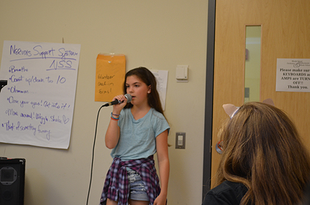](http://girlsrockri.org/wp-content/uploads/2016/08/drummers-10073.jpg)

 

_Your new duties have good life skills that go along with them (leadership, cooperation, stamina)._

 

[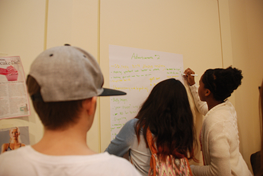](http://girlsrockri.org/wp-content/uploads/2016/08/drummers-10075.jpg)

 

_You and the other GRITs also are going to put a band together and perform on Friday, so it’s just like going to camp except you are held to a higher standard._

 

[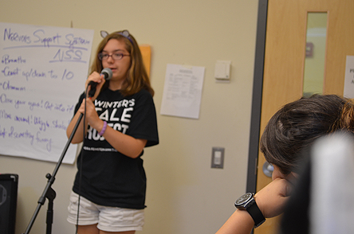](http://girlsrockri.org/wp-content/uploads/2016/08/drummers-10076.jpg)

 

_The campers look up to you, you’re in charge, you run things, BUT, it’s not the GRITs time to shine._

 

[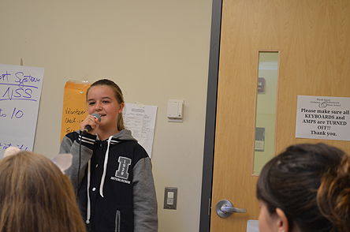](http://girlsrockri.org/wp-content/uploads/2016/08/drummers-10077.jpg)

 

_Focus on the campers and helping the volunteers out._

 

[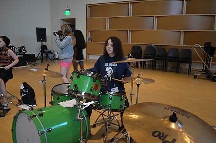](http://girlsrockri.org/wp-content/uploads/2016/08/drummers-100601.jpg)

 

_Get to know the students and don’t make GRITs a clique._

 

[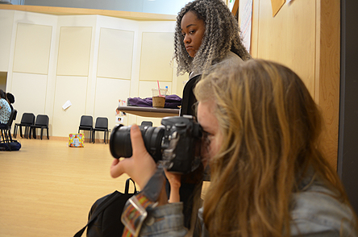](http://girlsrockri.org/wp-content/uploads/2016/08/drummers-10078.jpg)

 

_Be friendly and open to the campers. It can be awkward at first, talking to someone you don’t know, but your reassurance to the campers talkes off the nerves, anxiety about playing an instrument, and performing. They’ll be grateful._

 

[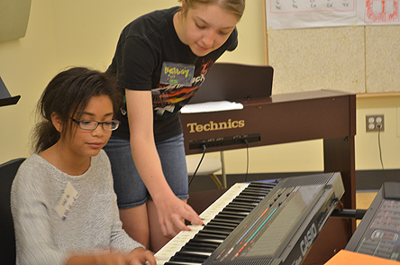](http://girlsrockri.org/wp-content/uploads/2016/08/drummers-10079.jpg)

 

_Don’t get too wrapped up in the leadership and dictate every decision to be made._

 

[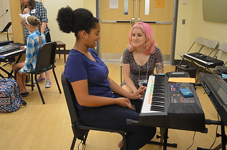](http://girlsrockri.org/wp-content/uploads/2016/08/drummers-10080.jpg)

 

_If it’s the opposite situation, where you’re getting no recognition at all, talk to the other GRITs and your instrument volunteers and ask to be involved more._

 

[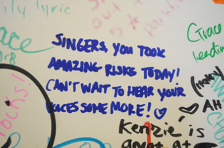](http://girlsrockri.org/wp-content/uploads/2016/08/drummers-10081.jpg)

 

_A super-important thing to remember is to ask questions if you’re unsure of something. Even if you think you won’t sound smart, everyone who’d be able to answer your questions was once in your place too._

 

[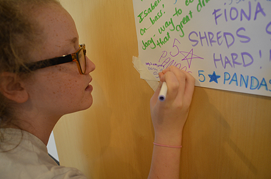](http://girlsrockri.org/wp-content/uploads/2016/08/drummers-10082.jpg)

 

_Be supportive to the campers and fellow GRITs, you never know what their home life is._

 

[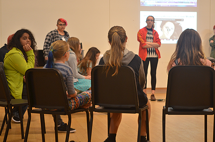](http://girlsrockri.org/wp-content/uploads/2016/08/drummers-10083.jpg)

 

_Also… don’t be too serious! Have fun! Being at Girls Rock, however which way you are involved, is always an awesome experience._

 

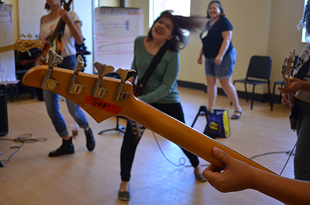

_Go forth GRITs and be the grittiest GRITs there ever was!_

 

all of this week's photos were taken by the GRITs

[dozens of photos from day four](https://www.flickr.com/photos/girlsrockri/albums/72157671461110250)

[don't miss tomorrow's Showcase](https://www.facebook.com/events/1072819902797658/)
