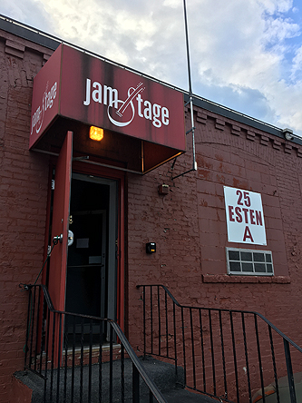
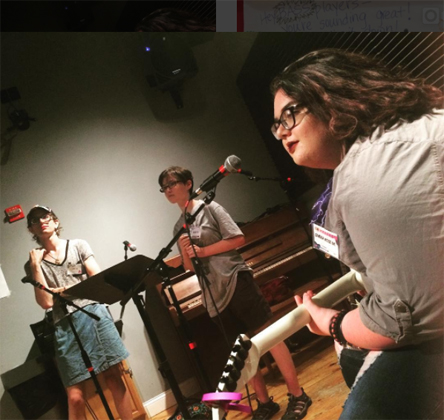
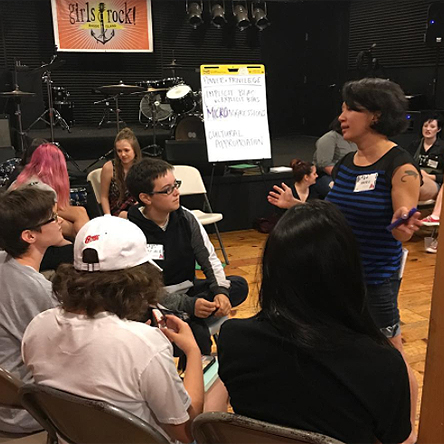
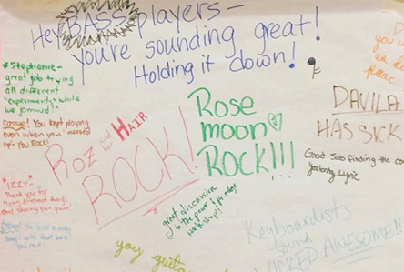
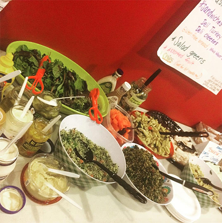

So far this week, the weather has been beautiful.

Over fifty adults are spending much of this week in the small windowless rooms of Pawtucket’s Jamstage.

 

Girls Rock! RI has two paid staff members. Everyone else working at camp is a volunteer. They took time away from jobs and families to attend a two-day volunteer training earlier this month, and now they’re at Jamstage, coaching bands, setting up gear, and making everything run smoothly.

And they keep coming back! Most of them have volunteered in previous years. (Same with the campers; over two-thirds of them have already been to Girls Rock Camp)

Girls Rock! RI relies on the generosity of donors and sponsors to fuel its year-round programming. That funding is crucial, but it could never buy what these volunteers bring to Girls Rock Camp every summer.

 

It’s not just musical expertise that the volunteers bring, either: there are band coaches who are social work professionals, visual artists leading the silkscreening, and university professors facilitating the workshops.

The workshops are master classes that expand on the campers’ band experience to get them thinking about the political, social and practical questions generated when dozens of young people come together to make music together.

 

Today’s workshops were _Power and Privilege_ and _Identity and Self-Esteem,_ and over the course of the week, they will also cover songwriting, healthy relationships, the art of creating merchandise, media literacy, feminism, booking bands, and DJing.

These conversations - and the relationships campers develop with the volunteers throughout the week - all bear fruit on Friday, when these young people take the stage at Aurora and perform their original songs for one another. [Will you be there?](https://www.facebook.com/events/465565597136295/?acontext=%7B%22action_history%22%3A%22[%7B%5C%22surface%5C%22%3A%5C%22page%5C%22%2C%5C%22mechanism%5C%22%3A%5C%22page_upcoming_events_card%5C%22%2C%5C%22extra_data%5C%22%3A[]%7D]%22%2C%22has_source%22%3Atrue%7D)

 

Special thanks today to Neighborhood Health Plan for their many years of support.

 

[ahead to day three](http://girlsrockri.org/girls-camp-2017-week-one-day-three/)

[back to day one](http://girlsrockri.org/girls-camp-2017-week-one-day-one/)
