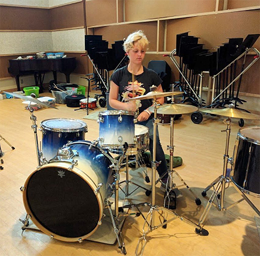
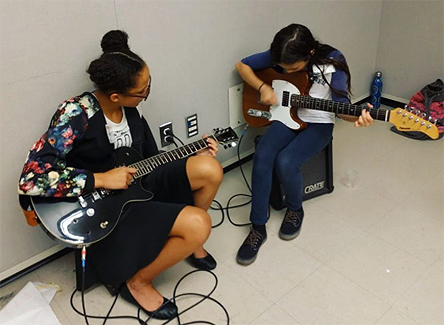
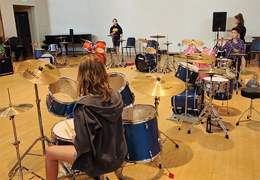
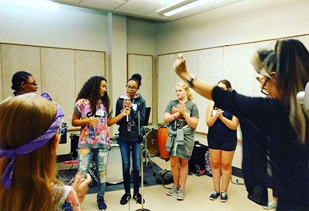
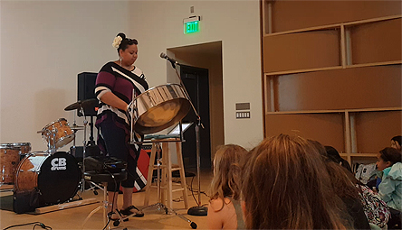
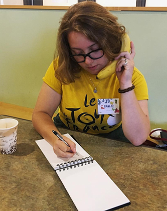
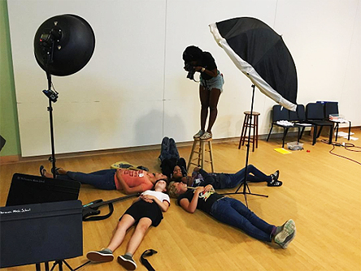
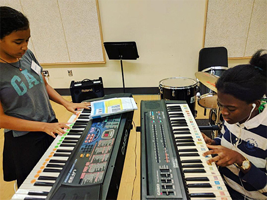

Part of the camp experience is learning to be loud.

 

Sometimes, things get loud at band practice.

 

But nothing at camp is louder than the group lessons, when ten bass players, ten drummers or ten keyboard players all lock into a groove and play together.

 

Even the vocals group lesson can get pretty loud!

 

Wednesday’s lunchtime performer, [Becky Bass](https://www.beckybass.com/), was a vocalist and steel pannist who dazzled the campers with the sound of the steel drum.

 

Lunch is provided for campers every day, thanks to the generosity of many volunteers and sponsors like Whole Foods Market and Trinity Brewhouse.

 

For several summers, every camp week has included a visit from the Like No Udder vegan ice cream truck as well.

 

 

Another perennial visitor is Cat Laine of Painted Foot Photography, who does an amazing album-cover-quality photo shoot with every band.

 

 

> [Silver Lining's first shirt, designed and printed by the band!](https://www.instagram.com/p/BX3jaiAhduR/)
> 
> A post shared by Girls Rock! Rhode Island (@girlsrockri) on Aug 16, 2017 at 1:26pm PDT

 

In the afternoon, while half the campers were in band practice, working on the songs they will perform on Friday night (are you coming?), the other half were learning to silkscreen t-shirts with their band logos.

 

The fruit all of this work - the shirts and the songs - will be on display at [Friday night's showcase concert](https://www.facebook.com/events/139898076603209/) at 5pm at the Met Cafe in Pawtucket. All are welcome. You are urged to attend.
