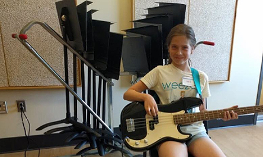
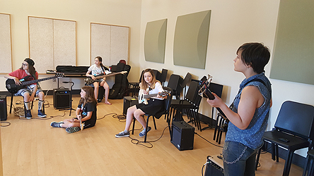
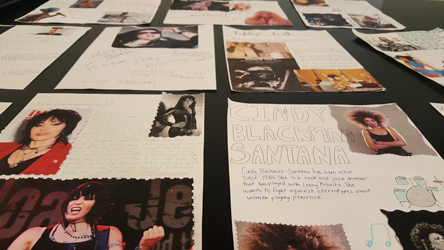
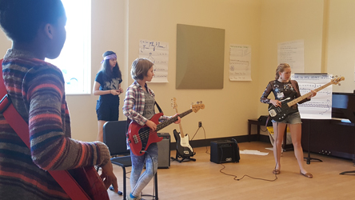
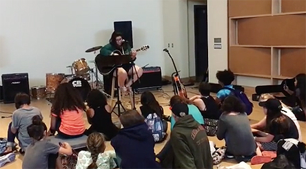
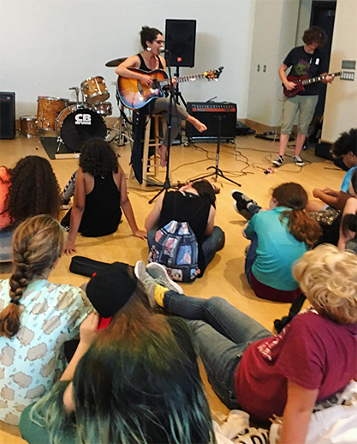
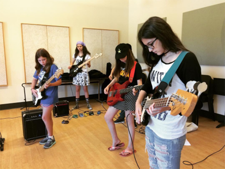
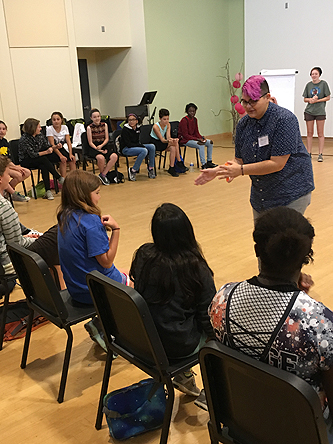

Girls Rock Camp isn’t just about campers finding their own voices.

 

It’s also about listening to one another, and finding role models and mentors in other generations.

 

All week, campers have been coming home and telling their parents all about Ani DiFranco, Sheila E., Joan Jett and other international names.

 

They’ve also been full of stories about Rachel, Noelle, Roz and all of the other volunteers who are serving as coaches and instructors this week.

 

Another kind of leadership was in the house today when the lunchtime performances began.

 

All three performers were longtime volunteers who have served on the board of Girls Rock! RI.

 

Another board member led the afternoon workshop on Feminist Survival Skills.

 

And the next generation of leaders ran the media literacy workshop in the morning; the Volunteers In Training, or VITS, are former campers who are learning what it takes to run camp each summer.

 

It’s not all hard work, though - the GRITs are also former campers, working at camp, who have their own band, too, and they will be performing alongside the campers’ bands at the final showcase, Friday night at 6pm at the Met Cafe in Pawtucket.
