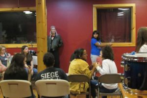
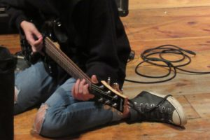
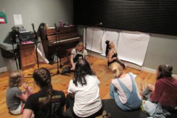
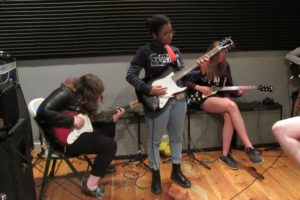
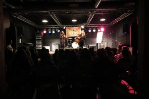
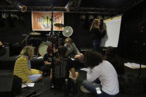

So it’s day two at Girls Rock Camp (session 2), but what does that even mean? It means more music, more learning, and more fun! Today, campers honed right in on their musical craft with lessons for their chosen instrument. But Girls Rock RI! isn’t just about the music, which is why their next stop was a workshop to delve into the topic of power and privilege. Keep reading below, or check out the photos, for more highlights from day 2:

- Who has power and privilege in schools? After today’s workshop with GRR! Co-Executive Director, it should be clear that even students have the power to create change - even in a system filled with adults!
- What else should you think about if you’re learning an instrument or writing a song? With two lessons plus band practice, campers received a variety of answers and strategies - as well as made progress on the songs they’ll present on Saturday!
- Campers also learned more about what it takes “to be a musician” with direct instruction from GRR! Co-Executive Director, Hilary Jones, Gear Coordinator, Jacqueline James, and a number of volunteers who led the afternoon workshop. The future is MUSIC!
- Space and time to go beyond music continued, even in the context of band practice, where each group took some time to think about and design unique logos to reflect their identities and their sound. Do you know how to design a logo? After this week...ask a camper!

No amount of words can truly capture the day, but the photos below will help. Or better yet... mark your calendars and tell your friends: The second #girlsrockri camp showcase happens this Saturday, August 18 at Askew Prov, 150 Chestnut St., Providence, RI. Doors will open at 2, music will start at 2:30, and inspiration will be forever.

         
