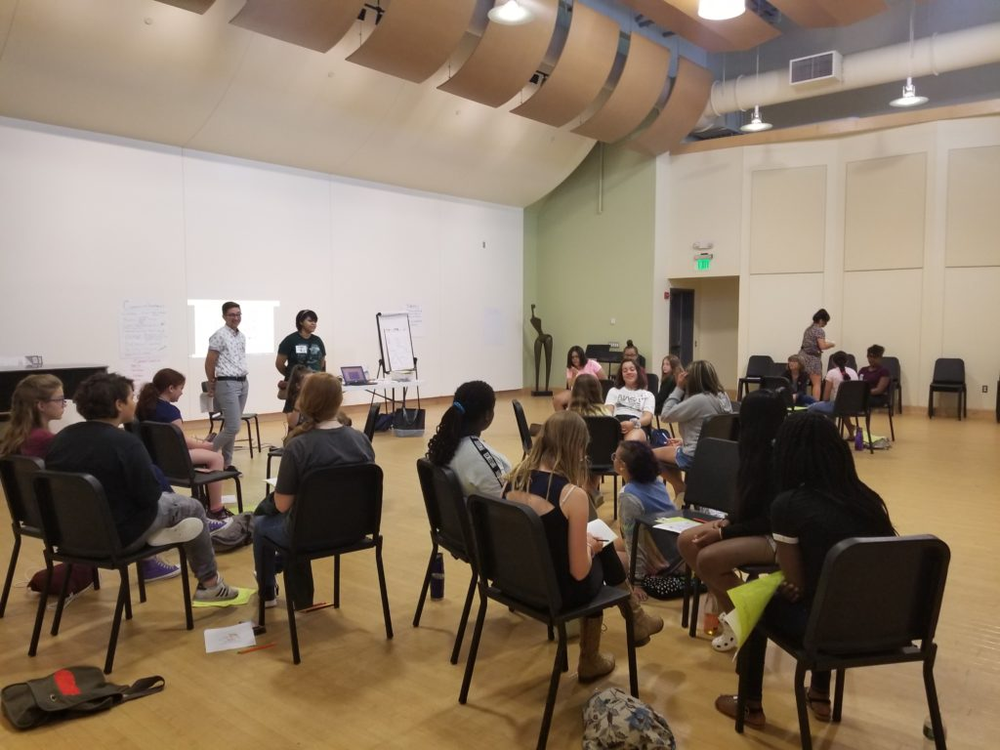
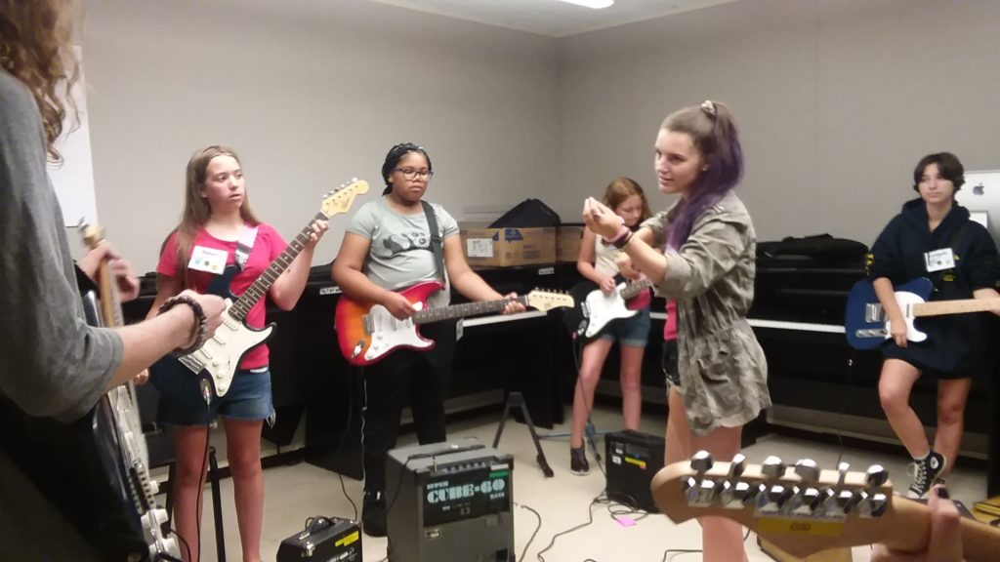
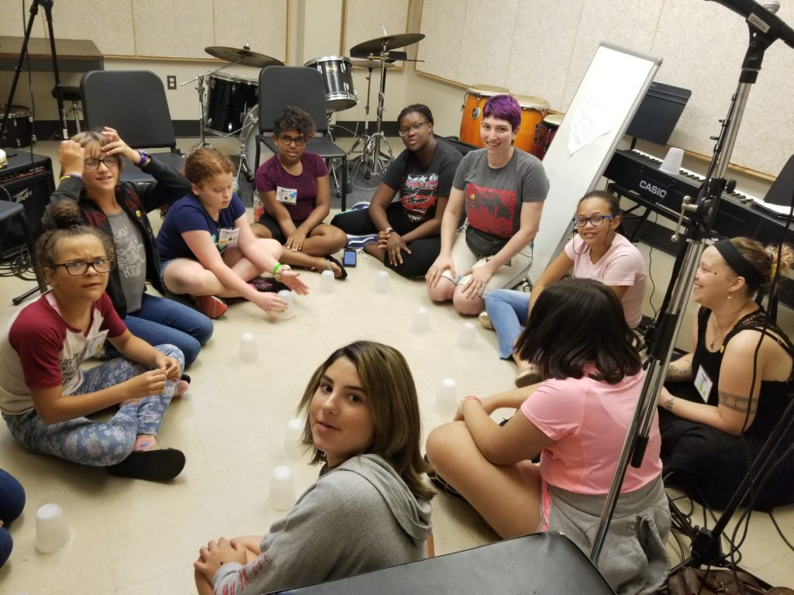
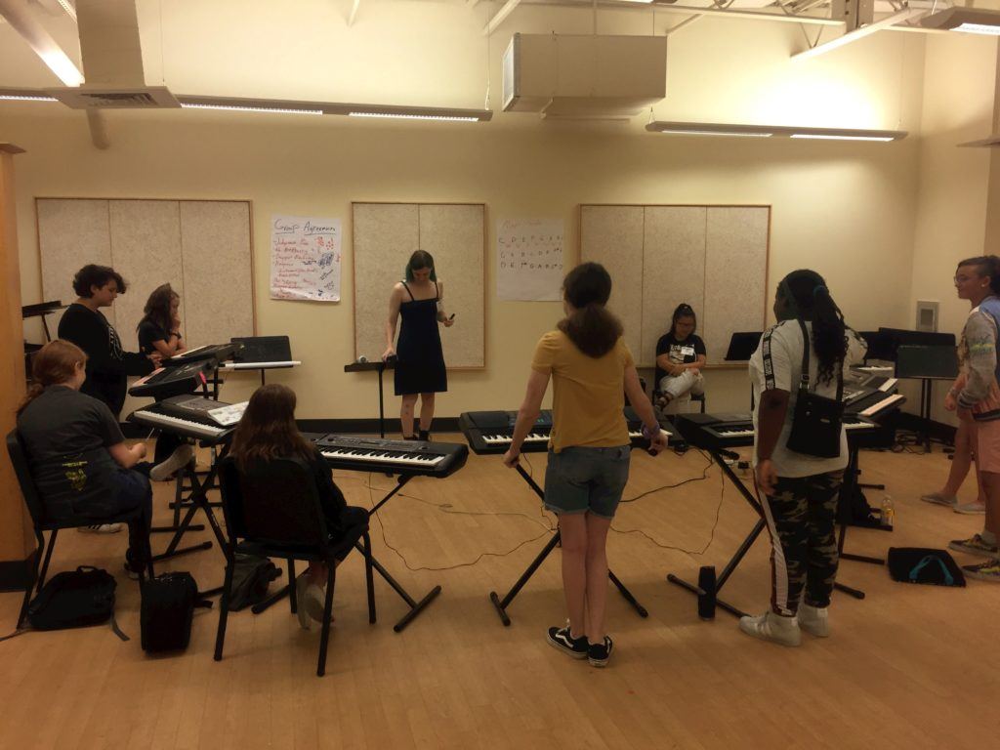
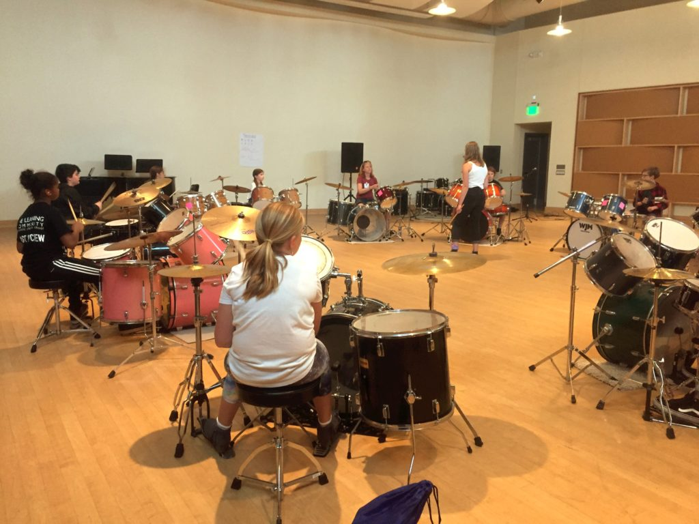
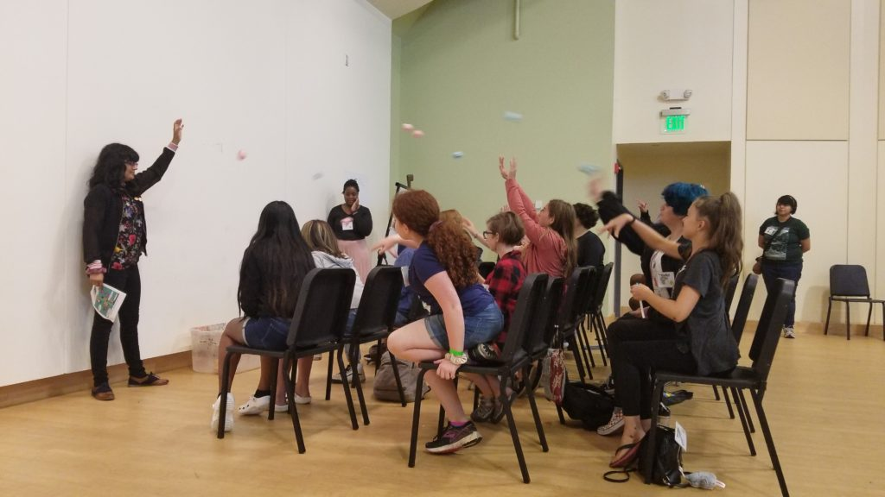

Day two for session one campers started off with breakfast and an introduction, followed by some campers going to a workshop and others going to instrument lessons. In today’s morning workshop, the campers covered the topic of Gender Identity. It discussed the serious parts of gender identity while still managing to lighten it up with fun activities such as giving mythical creatures genders. This workshop is very helpful for all campers, since it is such a big part of everyone’s lives.

Music lessons for all the campers went well as always. The vocalists sang “The Cup Song” together- with cups. The keyboardists got into partners and wrote a quick song together, then sharing it with their peers. In the bass room, campers learned how to play the well-known song Seven Nation Army by The White Stripes. The guitar campers learned A Minor and E Minor chords as a group, with help from their amazing instructors. Drummers got loud as always!

The afternoon featured band practice and a workshop on Power and Privilege. The workshop discussed power, privilege, and oppression, and campers did an interesting activity. They sat in rows different distances away from a bucket. Each row had a different color of paper, and they were asked to throw their paper into the bucket. Of course, those closest to the bucket had the easiest time getting their paper in it. Then groups debriefed and talked about how to help those in the back to get closer to the bucket. So, they talked about how those who experience more oppression might have a harder time getting what they need or want and that others with more privilege can help make change. 

Band practice is always a hit, and now the bands have names, too: Fearless ~ Shadow Wolves ~ Tuned Out ~ Magma?! ~ Pluto’s Snowfall ~ Zoinks!!! ~ The Fallen MICS ~ Milk and Cookies ~ Purpleish (GRITS)! Bands also got together and designed their personalized band logos that will be put on their t-shirts tomorrow in a screen printing workshop!

Come see these awesome bands and their cool logos at the showcase [this Saturday at The Met!](https://www.facebook.com/events/430771250810802/)
