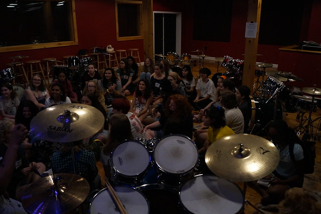
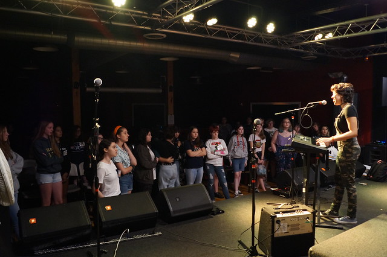
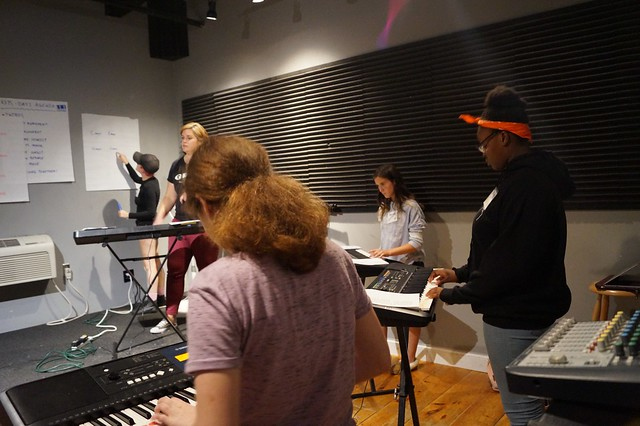
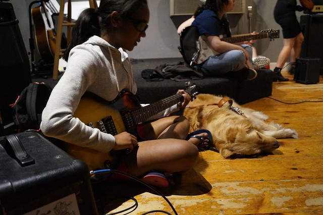
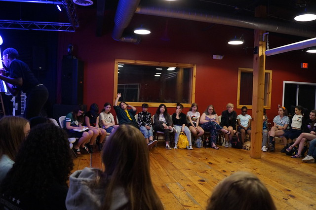
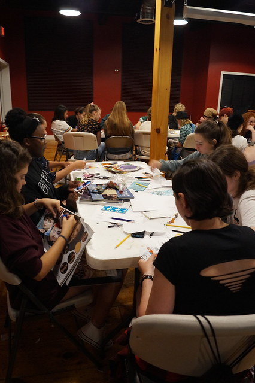
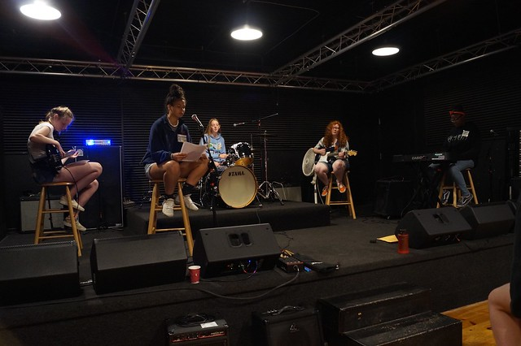
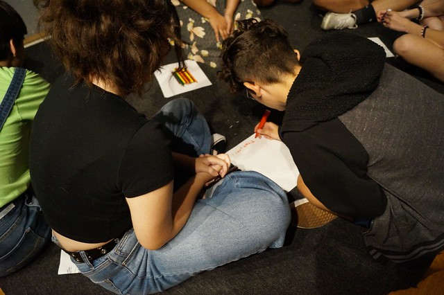

Morning circle

Tuesday is upon us and with that, a new day filled with possibilities! - campers arrived bright and early to get back to work on their original song and start working on their band logo for tomorrow's merch workshop.

The day was jam-packed with awesomeness, including a lunch performance by Luna, a Girls Rock Camp Alumn herself from our camp in 2012!

Luna performing

Keys are rocking!

Enjoying guitar practice!

Everybody has been working hard during instrument practices, some campers are discovering an instrument for the first time, whether it's guitar, keyboards, drums bass or vocals while others are challenging themselves on a new one with the support of our amazing group of volunteer instructors who are there to share their music skills and help them feel confident about their abilities, trying new things is hard but Girls Rock Camp is the best place to practice that good ole 'stretching not straining'.

The campers also took part in two workshops: Power & Privilege with a focus on education, the workshop was thought-provoking and allowed everyone to have discussions about the issues affecting their schools and how to discover their collective power as students.

For the Queer Musicians Who Rock workshop, campers got an opportunity to research musicians who identify as women, trans, nonbinary or gender-queer and create a zine using different visuals and report on who they chose, what makes them special and what they enjoy about their music.

The afternoon the day was filled with band practice. We got to drop-in some of the practices and are super psyched about the songs that are coming from every room! the magic is happening and we can't wait to share it with you all on Saturday at the showcase!

During the last part of practice today every band focused on designing a cool logo that represents them which will be used tomorrow during the merch-making workshop! they will be great!

So much more to come tomorrow!
